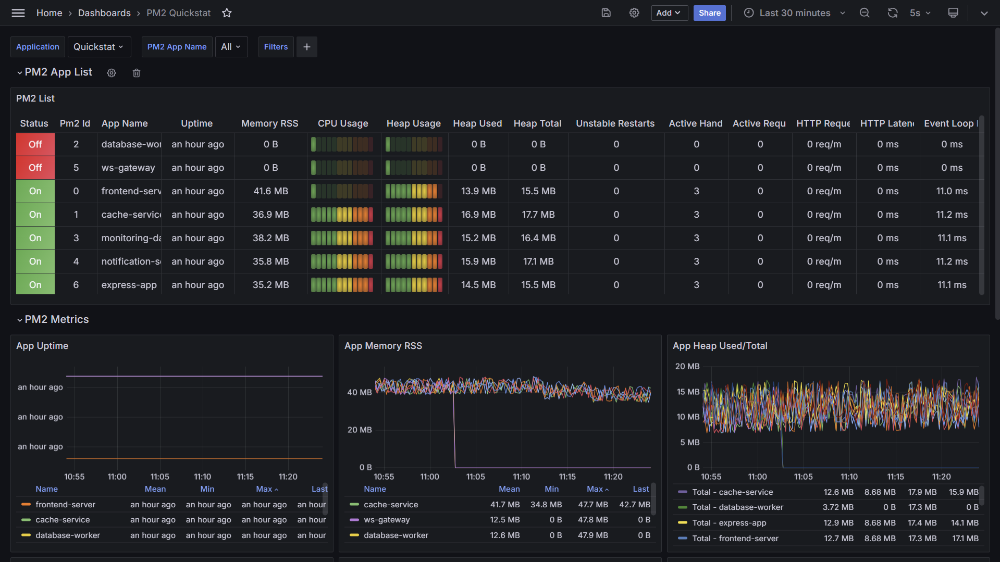
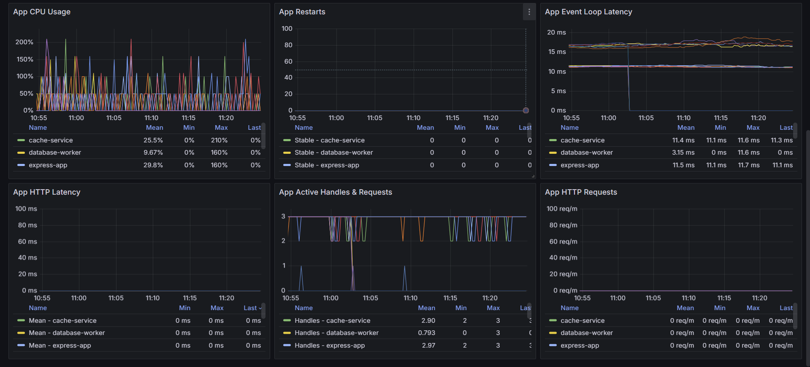

# pm2-prometheus-exporter

Monitoring your applications is just as important as running them. In this repository, you’ll find out how to monitor the status and metrics of your Node.js application (running via PM2) and visualize this data on Grafana dashboards.

> [!NOTE]
> The QuickStat PM2 Plugin offers seamless integration with PM2 instances, allowing effortless monitoring of key metrics. It exports these metrics to Prometheus, enabling visualization in Grafana dashboards.
>
> If you are new to QuickStat and its component, feel free to check the [official documentation](https://www.npmjs.com/package/@quickstat/core) for a detailed breakdown.

## Usage

```shell
cd /opt
git clone https://github.com/kraloveckey/pm2-prometheus-exporter.git
cd pm2-prometheus-exporter
npm install pm2 @quickstat/core @quickstat/prometheus @quickstat/pm2
pm2 start /opt/pm2-prometheus-exporter/quickstat-prom.js --name quickstat-prom
pm2 status
pm2 save
```

> [!NOTE]
> After setting up and starting the application, the metrics will be available at `http://localhost:3242` in Prometheus format and will be scraped by Prometheus, which will then be used for visualization in Grafana.
>
> The example above uses the `PrometheusDataSource` with the `ScrapeStrategy`. The `ScrapeStrategy` exposes the prometheus file on the given endpoint for being scraped from prometheus. You can also use the `PushGatewayStrategy` to push the metrics to the `PushGateway` of Prometheus. If you would like to use other data sources, you can take a look at the available data sources in the [@quickstat/core package](https://github.com/QuickStat/quickstat?tab=readme-ov-file#data-sources).

In the `/etc/prometheus/prometheus.yml` inside `scrape_configs` add this block:

```yaml
# PM2 Metrics
  - job_name: 'pm2-metrics'
    tls_config:
      insecure_skip_verify: true
    scrape_interval: 15s
    scheme: http
    static_configs:
      - targets: ['127.0.0.1:3242']
        labels:
          application: 'pm2-app-name'
```

Once Prometheus and Grafana are set up, you can add following Dashboard. Navigate to the Grafana dashboard page, click on **"New –> Import"** and paste the dashboard template URL or import via dashboard JSON model. Then, customize the dashboard as needed.





> [!NOTE]
> Modified and working version from [PM2 Monitoring | QuickStat by dxloop](https://grafana.com/grafana/dashboards/20864-pm2-quickstat/).
